

#### Objectives
*   Explain which initialization and configuration steps are required once per machine,
    and which are required once per repository.
*   Go through the modify-add-commit cycle for single and multiple files
    and explain where information is stored at each stage.
*   Identify and use Git revision numbers.
*   Compare files with old versions of themselves.
*   Restore old versions of files.
*   Configure Git to ignore specific files,
    and explain why it is sometimes useful to do so.

We'll start by exploring how version control can be used
to keep track of what one person did and when.
Even if you aren't collaborating with other people,
version control is much better for this than this:

  
  
"Piled Higher and Deeper" by Jorge Cham, http://www.phdcomics.com

### Creating a Repository

Let's start by creating a directory named `planets` for our work. For that: 

1. Open Git GUI.

   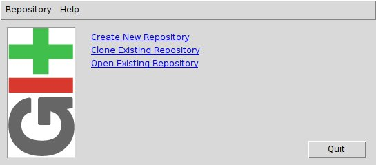
2. Select "Create New Repository".
3. Type `~/planets` for the directory name.
4. Select "Create".

   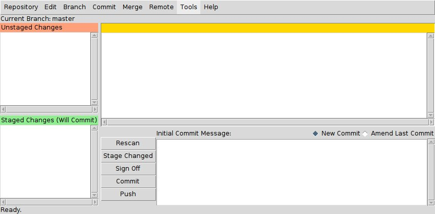

Let's ignore the Git GUI window for a couple of seconds.

If you open `~/planets` with your file manager you will find a directory called
`.git` (maybe this directory is hidden and you need to enable the list of hidden
files).

Git stores information about the project in this special sub-directory.
If we ever delete it,

### Setting Up

The first time we use Git on a new machine,
we need to configure a few things.
Here's how Dracula sets up his new laptop using the Git Gui:

1. From the menu bar, select "Edit" -> "Options ...".

   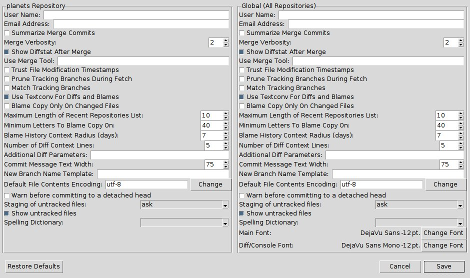
2. Type "Vlad Dracula" at the "User Name" field at the right column.
3. Type "vlad@tran.sylvan.ia" at the "Email address" field at the right column.
4. Select "Save".

(Please use your own name and email address instead of Dracula's,
and please make sure you choose an editor that's actually on your system,
such as `notepad` on Windows.)

### Tracking Changes to Files

Let's create a file called `mars.mr` that contains some notes
about the Red Planet's suitability as a base.
(We'll use the Firefox Addon named [MarkDown
Editor](https://addons.mozilla.org/en-US/firefox/addon/markdown-editor/?src=search)
to edit the file;

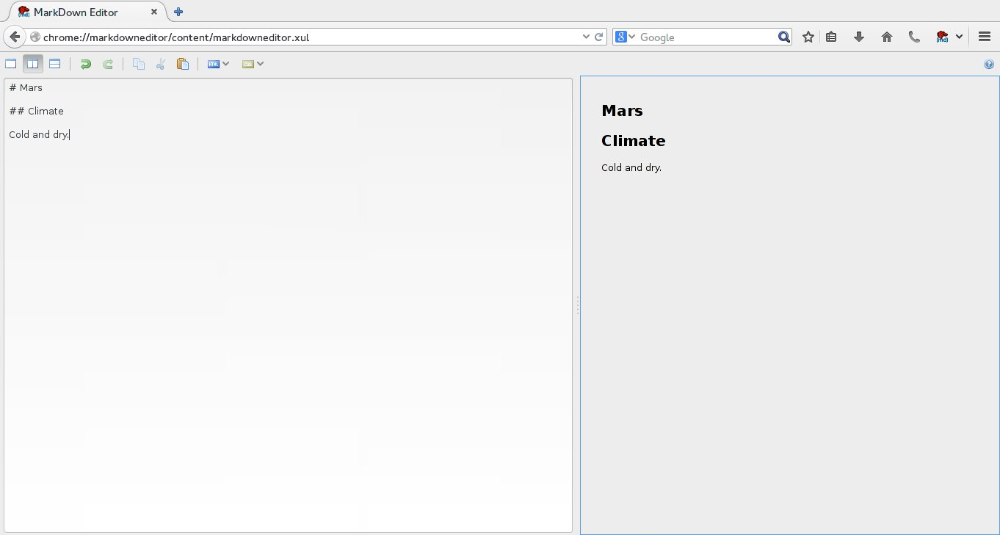

If we as Git GUI to rescan our repository,
Git GUI tells us that it's noticed the new file:

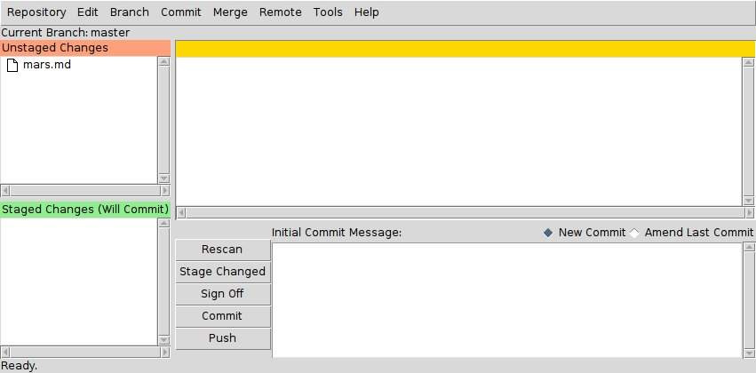

The "Unstaged Changes" box list files in the directory
that Git isn't keeping track of.
We can tell Git that it should do so using clicking on the paper image before
the name of the file:

Note that the file move from the "Unstaged Changes" box to the "Staged Changes"
box. Git now knows that it's supposed to keep track of `mars.txt`,
but it hasn't yet recorded any changes for posterity as a commit.
To get it to do that,
we need write an description at the "Commit Message" box and select "Commit":

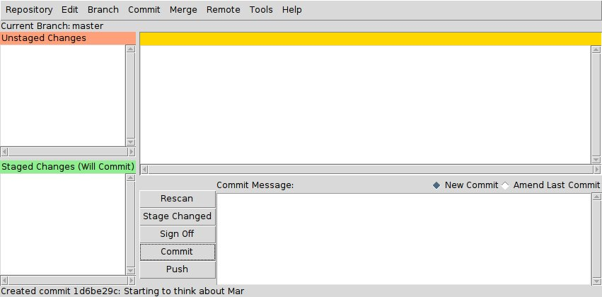

When we select "Commit"
Git takes everything at the "Staged Changes" box
and stores a copy permanently inside the special `.git` directory.
This permanent copy is called a [revision](../../gloss.html#revision)
and its short identifier is `1d6be29c`.
(Your revision may have another identifier.)

Note that the file at the "Staged Changes" box disappear and if we select
"Rescan" no file appears at the "Unstaged Changes" box.

If we want to know what we've done recently,
we can ask select "Repository" -> "Visualize All Branch History" from the menu
bar:

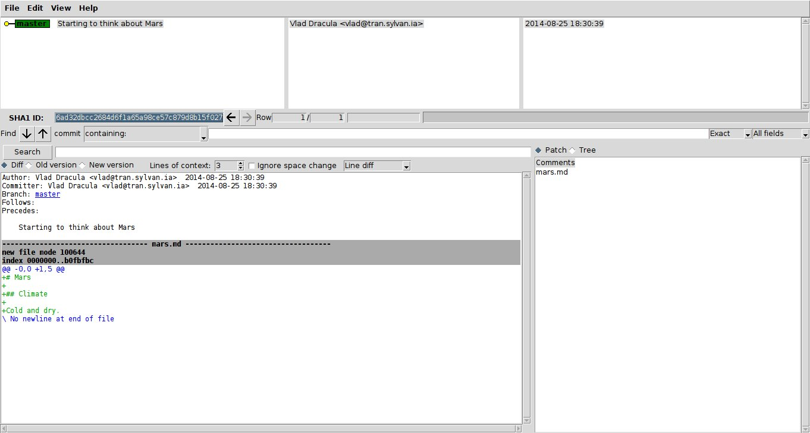

At the top left box you will find a list of all revisions made to a repository
in reverse chronological order. If you select one of the revisions you will find
at one of the box informations about that revision like
the revision's author,
when it was created,
and the log message Git was given when the revision was created.

> #### Where Are My Changes?
>
> If you open your file browser, we will still see just one file called `mars.txt`.
> That's because Git saves information about files' history
> in the special `.git` directory mentioned earlier
> so that our filesystem doesn't become cluttered
> (and so that we can't accidentally edit or delete an old version).

### Changing a File

Now suppose Dracula adds more information to the file.

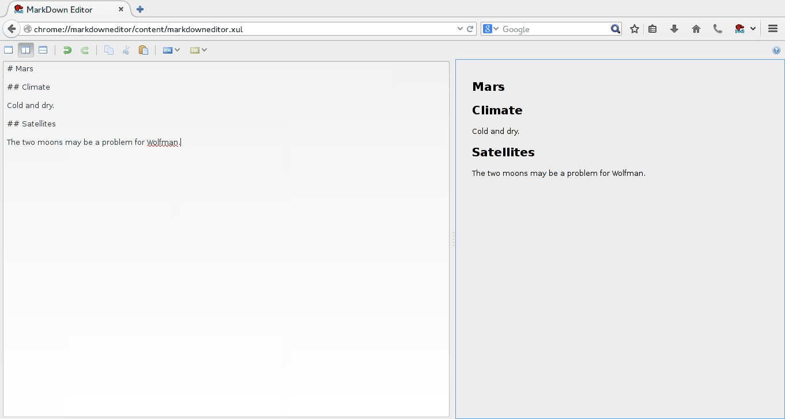

When we select "Rescan", `mars.md` will appear at the "Unstaged Changes" box.

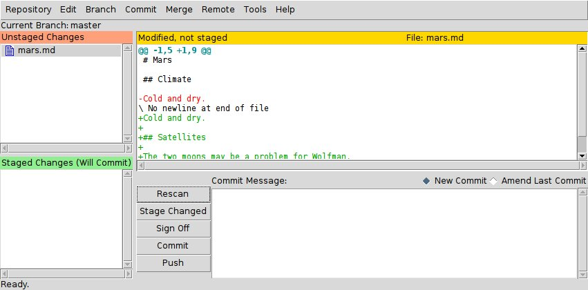

We have changed the file,
but we haven't told Git we will want to save those changes
(which we by clicking at the icon on the left of the file name)
much less actually saved them.
The changes that we made can be checked at the text box on the top right box,
which shows us the differences between
the current state of the file
and the most recently saved version.

The content of this box is cryptic because
it is actually a series of commands for tools like editors and `patch`
telling them how to reconstruct one file given the other.
The `+` markers in the first column show where we are adding lines.

Let's commit our change:

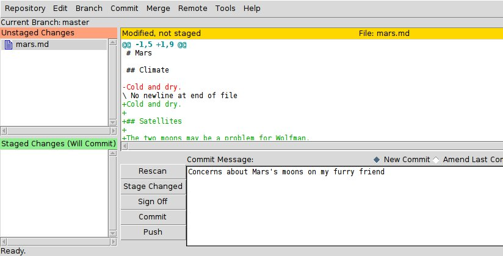

Whoops:
Git won't commit because we didn't stage at least one file.
Let's fix that by clicking on the icon on the left of `mars.md`:

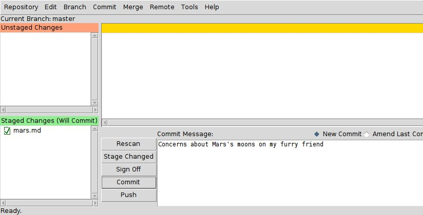

Git insists that we stage files to the set we want to commit
before actually committing anything
because we may not want to commit everything at once.
For example,
suppose we're adding a few citations to our supervisor's work
to our thesis.
We might want to commit those additions,
and the corresponding addition to the bibliography,
but *not* commit the work we're doing on the conclusion
(which we haven't finished yet).

To allow for this,
Git has a special staging area
where it keeps track of things that have been added to
the current [change set](../../gloss.html#change-set)
but not yet committed.

Let's look at the history of what we've done so far:

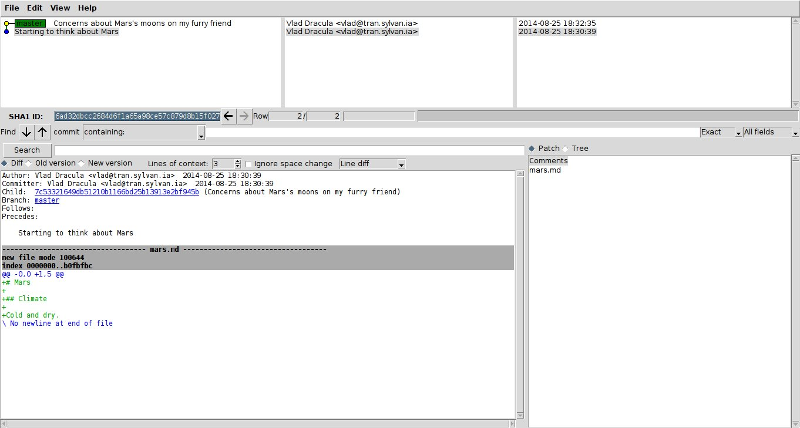

Let's watch as our changes to a file move from our editor to the staging area
and into long-term storage. First, we'll add another line to the file:

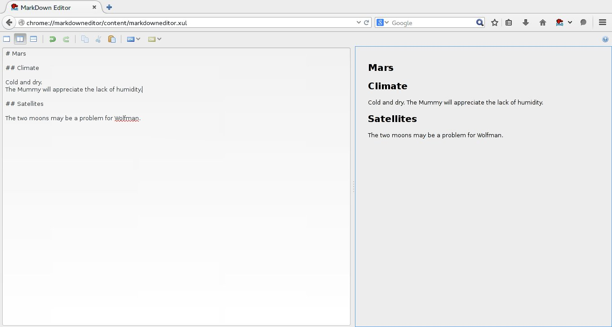

After rescan our directory:

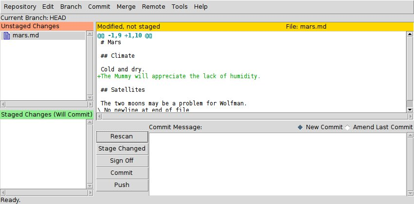

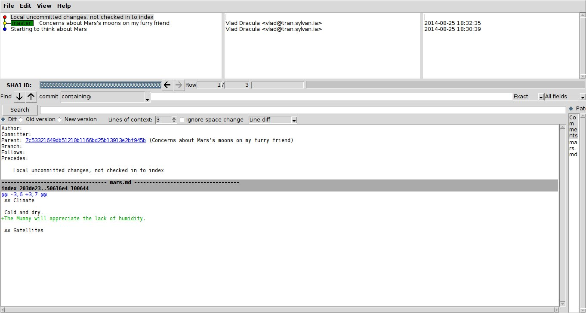

Note the red dot before "Local uncommited changes, not checked in to index".
Now let's put that change in the staging area:

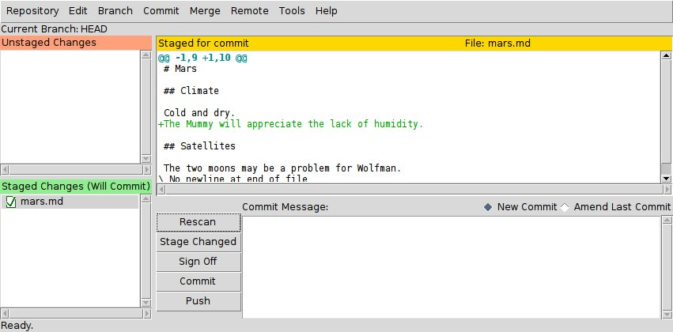

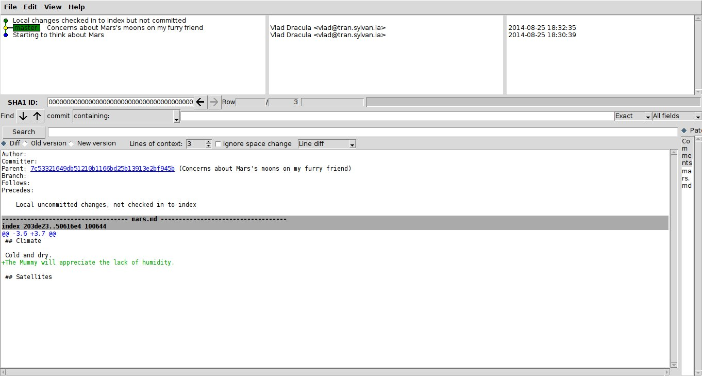

Note the blue dot before "Local changes checked in to index but not committed".
It shows us the difference between the last committed change and what's in the
staging area. Let's save our changes:

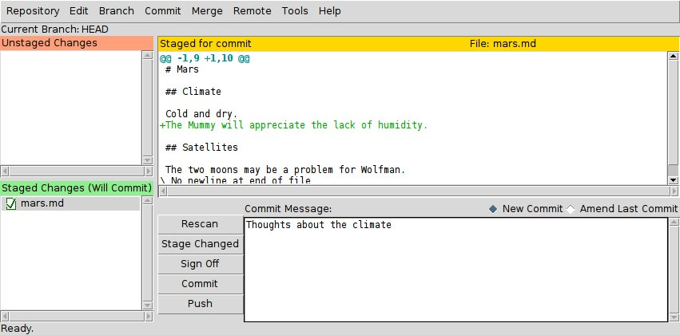

and look at the history of what we've done so far:

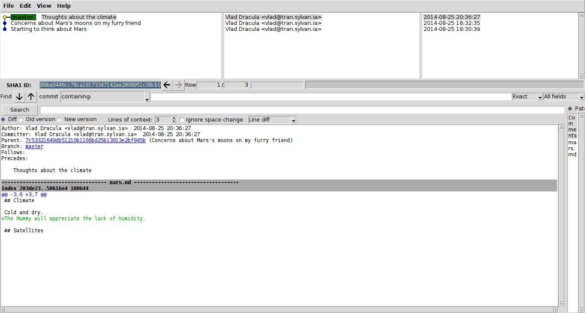

### Exploring History

If we want to see what we changed when, we just need to select (left click) the
last revision (the one with the `master` label) and right at the desire
revision. Choose the first option, `Diff this -> selected`.

### Recovering Old Versions

All right:
we can save changes to files and see what we've changed---how
can we restore older versions of things?
Let's suppose we accidentally overwrite our file:

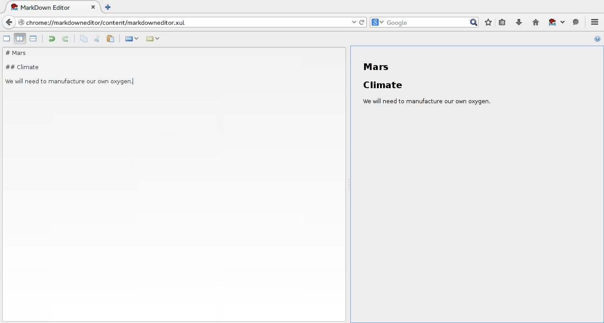

The file has been changed,
but those changes haven't been staged:

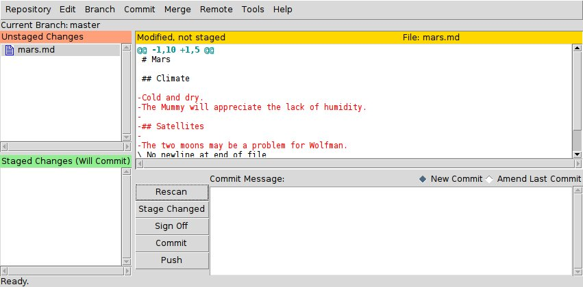

We can put things back the way they were
by using "Commit" -> "Revert Changes":

We're telling Git that we want to recover the version of the file recorded
in the last saved revision.
If we want to go back even further,
we can use "Branch" -> "Checkout" and inform a revision identifier:

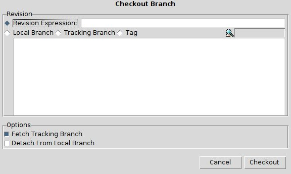

It's important to remember that
we must use the revision number that identifies the state of the repository
*before* the change we're trying to undo.
A common mistake is to use the revision number of
the commit in which we made the change we're trying to get rid of:

The fact that files can be reverted one by one
tends to change the way people organize their work.
If everything is in one large document,
it's hard (but not impossible) to undo changes to the introduction
without also undoing changes made later to the conclusion.
If the introduction and conclusion are stored in separate files,
on the other hand,
moving backward and forward in time becomes much easier.

### Ignoring Things

What if we have files that we do not want Git to track for us,
like backup files created by our editor
or intermediate files created during data analysis.
Let's create a few dummy files: `a.dat` and `b.dat` and `c.dat`.
And see what Git says:

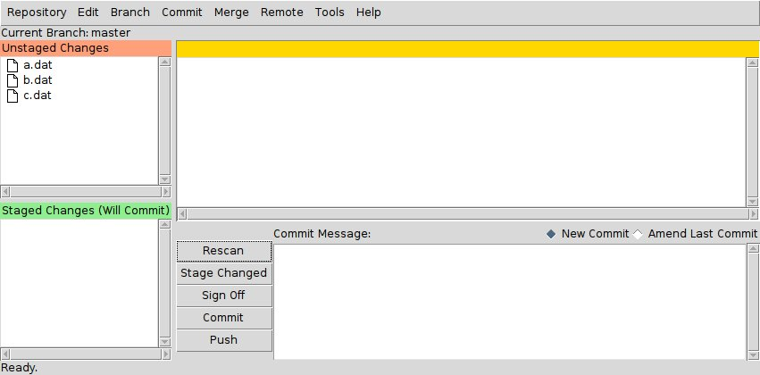

Putting these files under version control would be a waste of disk space.
What's worse,
having them all listed could distract us from changes that actually matter,
so let's tell Git to ignore them.

We do this by creating a file in the root directory of our project called
`.gitignore` with

~~~
*.dat
~~~

These patterns tell Git to ignore any file whose name ends in `.dat`
and everything in the `results` directory.
(If any of these files were already being tracked,
Git would continue to track them.)

Once we have created this file,
we will not be annoyed by the `*.dat` files:

The only thing Git notices now is the newly-created `.gitignore` file.
You might think we wouldn't want to track it,
but everyone we're sharing our repository with will probably want to ignore
the same things that we're ignoring.
Let's add and commit `.gitignore`:

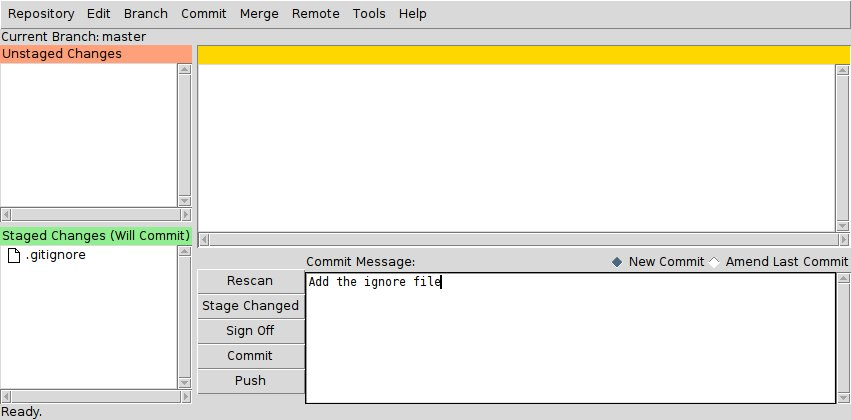

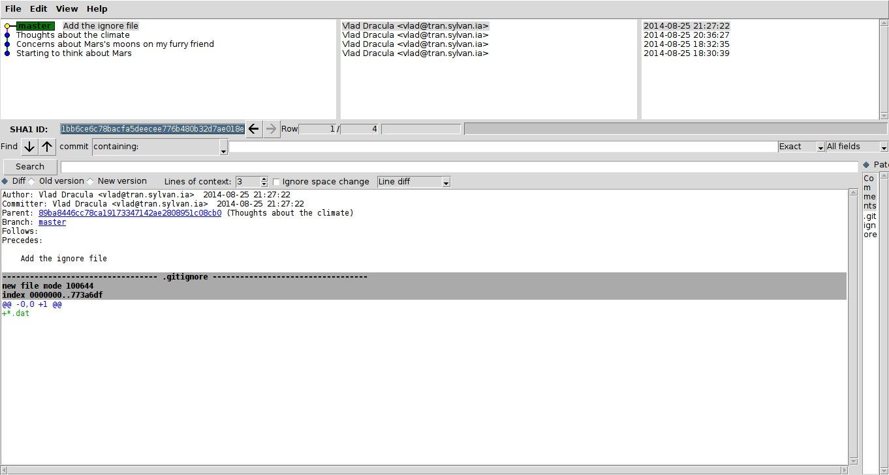

As a bonus,
using `.gitignore` helps us avoid accidentally adding files to the repository that we don't want.

#### Key Points
*   Use `git config` to configure a user name, email address, editor, and other preferences once per machine.
*   `git init` initializes a repository.
*   `git status` shows the status of a repository.
*   Files can be stored in a project's working directory (which users see),
    the staging area (where the next commit is being built up)
    and the local repository (where snapshots are permanently recorded).
*   `git add` puts files in the staging area.
*   `git commit` creates a snapshot of the staging area in the local repository.
*   Always write a log message when committing changes.
*   `git diff` displays differences between revisions.
*   `git checkout` recovers old versions of files.
*   The `.gitignore` file tells Git what files to ignore.

Create a new Git repository on your computer called `bio`.
Write a three-line biography for yourself in a file called `me.txt`,
commit your changes,
then modify one line and add a fourth and display the differences
between its updated state and its original state.

The following sequence of commands creates one Git repository inside another:

~~~
cd           # return to home directory
mkdir alpha  # make a new directory alpha
cd alpha     # go into alpha
git init     # make the alpha directory a Git repository
mkdir beta   # make a sub-directory alpha/beta
cd beta      # go into alpha/beta
git init     # make the beta sub-directory a Git repository
~~~
{:class="in"}

Why is it a bad idea to do this?

