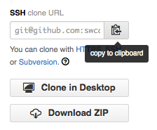

#### Objetivos
*   Explicar o que são repositórios remotos e por que eles são úteis.
*   Explicar o que acontece quando um repositório remoto é clonado.
*   Explicar o que acontece quando mudanças são obtidas e enviadas para um
    repositório remoto.

Controle de versão começa a fazer falta quando começamos a colaborar com outras
pessoas. Já temos quase todas as ferramentas necessárias para fazer isso, só
falta aprendermos como copiar alterações de um repositório para outro.

Sistemas como Git permite trocar alterações entre dois repositórios quaisquer.
Na prática, entretanto, é mais fácil utilizar uma cópia como hub central e
mantê-lo em um servidor conectado à internet do que no notebook de alguém.
Grande parte dos programadores utilizam serviços de hospedagem como
[GitHub](https://github.com) ou [BitBucket](https://bitbucket.org) para
armazenar esses cópias. Vamos explorar os pros e os contras dessa abordagem no
final dessa lição.

Vamos começar por compartilhar as mudanças que fizemos no nosso projeto com o
mundo. Autentique-se no GitHub e clique no ícone no canto superior direito para
criar um novo repositório denominado `planetas`:

Nomeie o seu repositório de "planetas" e selecione "Create Repository":

Assim que o repositório for criado, GitHub irá mostrar uma página com uma URL e
algumas informações de como configurar seu repositório local:

Esse procedimento realiza os seguintes comandos nos servidores do GitHub:

~~~
$ mkdir planetas
$ cd planetas
$ git init
~~~
{:class="in"}

Nosso repositório local ainda contem nosso trabalho anterior no arquivo
`marte.txt` mas o repositório remoto no GitHub não contem nenhum arquivo:

O próximo passo é conectar esses dois repositórios. Fazemos isso transformando o
repositório no GitHub um repositório [remote](../../gloss.html#repository-remote)
para o repositório local. Na página inicial do repositório no GitHub encontra-se
a string necessária para identificá-lo:

Selecione 'HTTPS' para alterar o [protocol](../../gloss.html#protocol) SSH para
HTTPS. SSH é mais conveniente no dia-a-dia mas requer alguns passos adicionais
para configurar e por esse motivo vamos ficar com o HTTPS:

Copie essa URL do navegador, vá para seu repositório local e execute o comando:

~~~
$ git remote add origin https://github.com/vlad/planetas
~~~
{:class="in"}

Certifique-se de utilizar a URL do seu repositório ao invés da URL do Vlad: a
única diferença deve ser seu nome de usuário no lugar de `vlad`.

Você pode verificar que o comando anterior foi executado corretamente utilizando
`git remote -v`:

~~~
$ git remote -v
~~~
{:class="in"}
~~~
origin   https://github.com/vlad/planetas.git (push)
origin   https://github.com/vlad/planetas.git (fetch)
~~~
{:class="out"}

O nome `origin` é o apelido local para seu repositório remoto: você pode
utilizar outro apelido no lugar se você desejar, mas `origin` é a opção mais
utilizada.

Uma vez que o apelido `origin` está configurado, o comando a seguir irá copiar
as alterações no repositório local para o repositório no GitHub:

~~~
$ git push origin master
~~~
{:class="in"}
~~~
Counting objects: 9, done.
Delta compression using up to 4 threads.
Compressing objects: 100% (6/6), done.
Writing objects: 100% (9/9), 821 bytes, done.
Total 9 (delta 2), reused 0 (delta 0)
To https://github.com/vlad/planetas
 * [new branch]      master -> master
Branch master set up to track remote branch master from origin.
~~~
{:class="out"}

Agora o seus repositórios locais e remotos estão no seguinte estado:

> #### A opção '-u'
>
> Normalmente você vai encontrar a opção `-u` em outras documentações
> disponíveis na internet. Ela está relacionada com conceitos apresentados na
> nossa lição intermediária e pode ser ignorada sem problemas.

Você também pode pegar as alterações no seu repositório remoto para o local:

~~~
$ git pull origin master
~~~
{:class="in"}
~~~
From https://github.com/vlad/planetas
 * branch            master     -> FETCH_HEAD
Already up-to-date.
~~~
{:class="out"}

Nesse caso, nenhuma modificação foi recebida porque os dois repositórios já
estavam sincronizados. Se alguém tivesse enviado alguma alteração para esse
repositório no GitHub, o comando anterior teria baixado as modificações para o
repositório local.

Podemos simular trabalhar com outro contribuidor utilizando outra cópia do
repositório na nossa máquina local. Para isso, `cd` no diretório `/tmp`. (Note o
uso do caminho absoluto: não utilize um diretório `tmp` dentro do repositório).
Ao invés de criarmos um novo repositório utilizando `git init`, vamos
[clonar](../../gloss.html#repository-clone) um repositório existente no GitHub:

~~~
$ cd /tmp
$ git clone https://github.com/vlad/planetas.git
~~~
{:class="in"}

`git clone` cria uma nova cópia local do repositório remoto. (Fazemos isso no
diretório `/tmp` ou em algum outro diretório para evitar sobreescrever o
diretório `planetas` já existe.) Nosso computador agora possui duas cópias do
repositório:

Vamos fazer uma mudança na cópia em `/tmp/planetas`:

~~~
$ cd /tmp/planetas
$ nano plutao.txt
$ cat plutao.txt
~~~
{:class="in"}
~~~
Também é um planeta!
~~~
{:class="out"}
~~~
$ git add plutao.txt
$ git commit -m "Algumas notas sobre Plutão"
~~~
{:class="in"}
~~~
 1 file changed, 1 insertion(+)
 create mode 100644 plutao.txt
~~~
{:class="out"}

e depois enviar as mudanças para o GitHub:

~~~
$ git push origin master
~~~
{:class="in"}
~~~
Counting objects: 4, done.
Delta compression using up to 4 threads.
Compressing objects: 100% (2/2), done.
Writing objects: 100% (3/3), 306 bytes, done.
Total 3 (delta 0), reused 0 (delta 0)
To https://github.com/vlad/planetas.git
   9272da5..29aba7c  master -> master
~~~
{:class="out"}

Note que não precisamos criar um repositório remoto denominado `origin`: Git faz
isso automaticamente, utilizando esse nome, quando clonamos um repositório.
(Esse é o motivo de `origin` ser uma escolha sensata anteriormente quando
configuramos um repositório remoto manualmente.)

Agora, nossos três repositórios parece com:

Agora podemos baixar as alterações no repositório original da nossa máquina:

~~~
$ cd ~/planetas
$ git pull origin master
~~~
{:class="in"}
~~~
remote: Counting objects: 4, done.
remote: Compressing objects: 100% (2/2), done.
remote: Total 3 (delta 0), reused 3 (delta 0)
Unpacking objects: 100% (3/3), done.
From https://github.com/vlad/planetas
 * branch            master     -> FETCH_HEAD
Updating 9272da5..29aba7c
Fast-forward
 plutao.txt | 1 +
 1 file changed, 1 insertion(+)
 create mode 100644 plutao.txt
~~~
{:class="out"}

de modo que temos:

Na prática, nós provavelmente nunca teremos duas cópias do mesmo repositório na
mesma máquina ao mesmo tempo. Normalmente, uma dessas cópias estará no nosso
notebook e a outra no computador do laboratório ou na máquina de um colaborador.
Enviar e baixar alterações permite um mecanismo segura de compartilhar o
trabalho entre diferente pessoas e máquinas.

#### Pontos Chaves
*   Um repositório Git local pode estar conectado a um ou mais repositórios
    remotos.
*   Utilize o protocolo HTTPS para conectar aos repositórios remotos até que
    você tenha aprendido como configurar o SSH.
*   `git push` copia as alterações locais para um repositório remoto.
*   `git pull` copia as alterações de um repositório remoto para um local.
*   `git clone` cria uma cópia local de um repositório remoto com este conectado
    e identificado por `origin`.

- Crie um repositório no GitHub.
- Clone o repositório que acabou de criar.
- Adicione um arquivo.
- Envie suas mudanças para o GitHub.
- Procure pelo [timestamp](../../gloss.html#timestamp) das mudanças no GitHub.
  Como que ele faz para salvar esse tempo e como ele faz?

